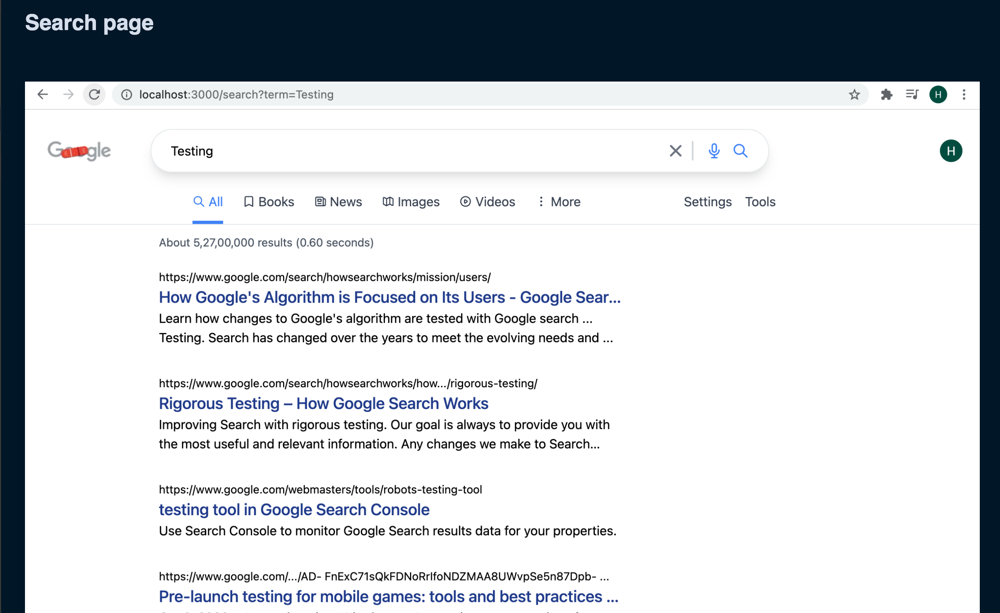
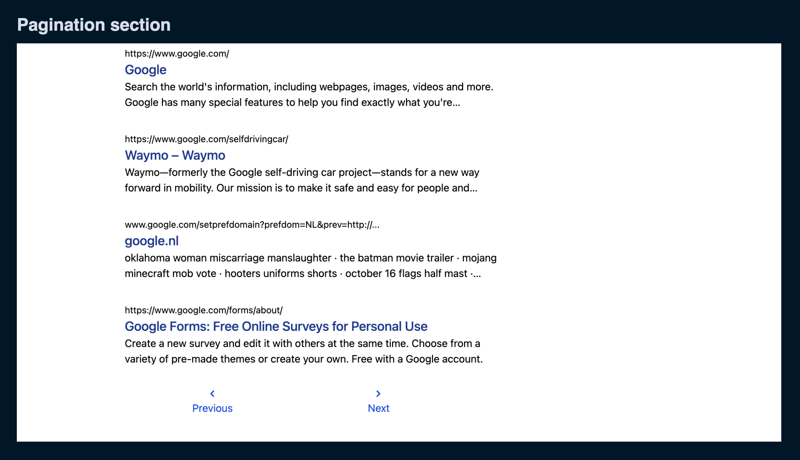

This is a [Next.js](https://nextjs.org/) project bootstrapped with [`create-next-app`](https://github.com/vercel/next.js/tree/canary/packages/create-next-app).

It is built with [Tailwind](https://tailwindcss.com/) and hence _Mobile First_ responsive design!

## Getting Started

First, run the development server:

```bash
npm run dev
# or
yarn dev
```


Before you start searching (using Google API), there are two steps that you need to do -
- Google API key (https://developers.google.com/custom-search/v1/introduction#identify_your_application_to_google_with_api_key
  )
- Context API key (https://cse.google.com/cse/create/new)

These two keys need to store in _.env_ file and  hence you won't find it on this repo.

* Google API (developer) has a quota of 10 API calls per day and hence there is _an internal variable (useDummyData) to avoid this quota limit_.


Once you're done with the setting of above two keys in the .env file,

Open [http://localhost:3000](http://localhost:3000) with your browser to see the result.

### First main page

---
### Search  page

---
### Pagination section

# nextjs-googleclone
